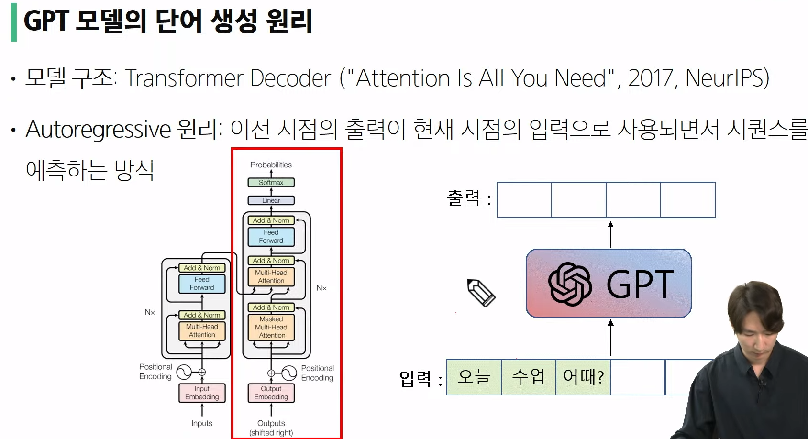
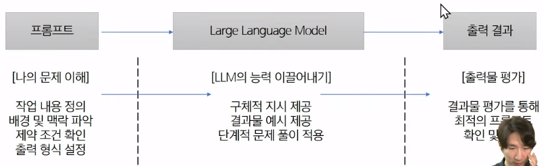
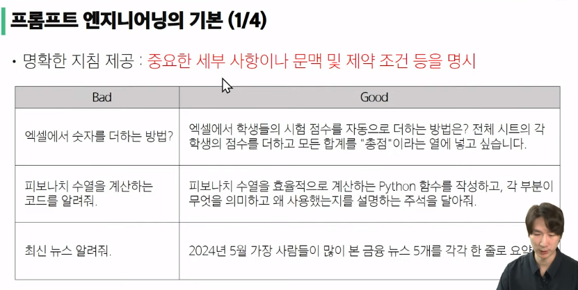
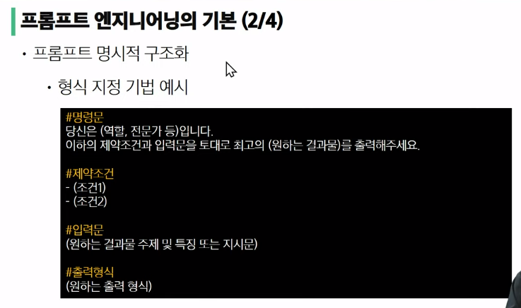
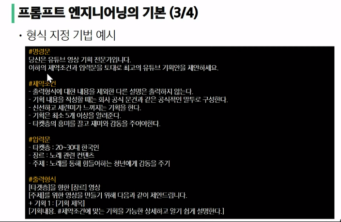
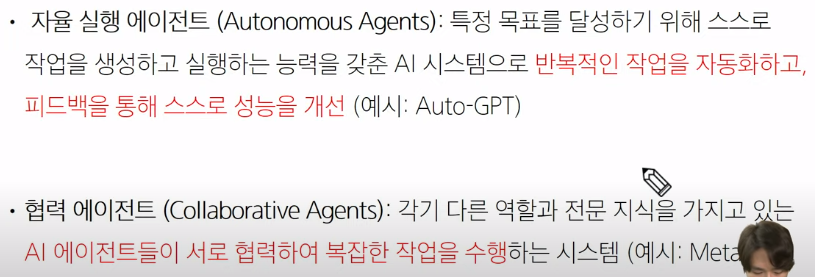

| 인공지능 모델                | 프로그래밍                      |
| ---------------------- | -------------------------- |
| 입력과 출력의 관계를 데이터를 통해 학습 | 입력과 출력의 관계에 대한 알고리즘을 직접 구현 |
## 생성형 인공지능

1. 정의
> 텍스트, 이미지, 오디오, 비디오 등 새로운 콘텐츠를 생성할 수 있는 AI 기술

2. 기반 코드

|VAE, GAN | Diffusion, Transformer Decoder|
|----------|-----------------------------------|
| 연속적 | 비연속적 |
- 인공지능이 단계적으로 계산할 때 더 좋은 결과물이 나왔다.
- but 리소스(시간, 비용)가 많이 들어서 단계적 생성에 대한 최적화를 하고 있음.

3. 프롬프트
- 생성형 AI에 주어지는 입력 데이터. 생성형 AI가 출력할 컨텐츠의 내용 및 스타일 등을 안내하는 역할을 수행함.

4. 예시
| 종류     | 예시                                          |
| ------ | ------------------------------------------- |
| 이미지 생성 | DALL-E, Midjourney, Stable Diffusion Web UI |
| 동영상 생성 | Pixerse, Haiperai, Sora                     |
| 텍스트 생성 | ChatGPT, Gemini, Claude                     |
| 음악 생성  | Suno, Udio                                  |

## LLM(대규모 언어 모델)

> 정의: 텍스트 생성, 번역, 질문 답변, 요약 등 다양한 언어 관련 작업을 수행하는 하나의 모델

### 특징
- 파라미터는 보통 실수형 데이터로, 4byte를 차지한다.
- GPT의 경우 기존 대화까지 모두 토큰에 집어넣어서 프롬프트를 사용합니다.
- 토큰 수가 늘어날수록 멀티모달이 가능해질 가능성이 존재합니다.

#### 같은 프롬프트를 넣어도 답변이 달라지는 이유
- temperature 라는 인수가 있어 일정한 확률 내에서 다양하게 답변을 준다.
- 모델을 지휘하는 w값은 조정하지 않지만 top_p라는 파라미터를 통해 얼마만큼을 후보군을 둘 건지 선택이 가능하다.
- 확률이 높은 k개 중에서 랜덤하게 샘플링해서 매번 다양하게 답변을 준다.

> 원리: 
> 입력[프롬프트]과 출력 사이의 조건부 확률 분포를 학습합니다. 새로운 입력이 주어졌을 때 학습된 조건부 확률 분포를 통해 모든 토큰[단어]별 확률을 예측하고, 그 중 가장 가능성이 높은 토큰을 선택하여 답변합니다.
> 마지막에 EOS(end of sequence) 토큰이 나올 때까지 이를 반복합니다.
> → 입력값보다 출력값이 싼 이유입니다.

### LLM의 단점:
1. GPT는 실제로 계산하는 것이 아니라 일반적인 출력들을 학습하는 것이라 학습데이터를 벗어나는 입력은 신뢰할 수 없는 출력을 생성할 가능성이 크다.
2. 데이터 편향: 학습데이터의 편향으로 인해 특정한 관점이나 답변을 더 자주 생성할 가능성이 큼.
3.  데이터 오류: 잘못된 정보나 오류가 포함된 학습 데이터는 모델이 부정확하거나 잘못된 출력을 지속적으로 생성.
	- 하지만 실제로 활용되는 LLM의 경우 다양한 폭의 데이터를 많이 학습시켜서 극복하는 경우가 많다.

### LLM의 학습방법

1. 사전학습 (Pre-training)
	- 입력 텍스트의 다음 단어를 예측하는 훈련
	- 방법: 주어진 문맥 X1,X2....X에서 다음 단어 x의 조건부 확률 P(XXX2Xz_i)를 최대화
	- 학습 장점: 입력에 따른 정답 데이터 셋을 따로 구축하지 않아도 됨 (Sclf-Supervised Learning)
	- 학습 내용:
		- 문법 이해: 자연스럽고 정확한 문장을 생성
		- 문맥 이해: 문맥에 맞는 단어를 예측하여 일관성 있는 텍스트 생성
		- 지식 활용: 일반 상식과 지식을 바탕으로 정보 제공
		- 감정 분석: 텍스트의 감정적 톤을 파악하고 적절한 단어 선택
	- 학습용 데이터 셋: 인터넷에서 수집된 방대한 양의 텍스트 데이터 등
		- Wikipedia, 학술 논문, 뉴스, 전자책, 인터넷 크롤링 등

2. 파인튜닝 (Fine-tuning): 사전 학습된 모델을 특정 작업에 맞게 재학습하는 과정
	- Instruction learning : 주어진 지시문(명령어)를 이해하고 수행하도록 학습
	- 방법: 다양한 작업에 대한 명령어와 그에 맞는 예시 답변을 포함한 데이터셋을 통해 조건부 확률 P(예시 답지시문)을 최대화 하도록 학습
	- 학습의 장점 : 동일한 모델로 다양한 기능을 수행 및 범용성 향상
	- 학습 내용 : 자동 번역, 문서 요약, 문법 교정, 질의 응답, 코드 생성, 코드 디버깅 등

#### LLM의 기술적 한계점과 해결방안

1. 모호한 지시처리: 다양한 해석을 할 수 있는 질문이나 지시에 대해 명확한 답변을 제공하지 못할 수 있음.
    - 여러 컨텍스트로 읽을 수 있으므로 두루뭉실한 답변이 나옴.
    - 질문에 대한 배경과 세부 정보, 구체적인 답변 예시 등을 통해 사용자가 원하는 답변을 할 수 있도록 유도해야 함.
2. 맥락 유지의 어려움: 긴 대화나 복잡한 문맥을 지속적으로 유지하는 데 어려움이 있음.
    - 처리할 수 있는 최대 토큰 수가 정해져 잇으므로 기존의 질문 및 답변의 핵심적인 정보들을 요약하여 맥락을 유지할 수 있도록 함.
3. 할루시네이션: 문맥에는 맞는 듯 보이지만 실제로는 근거 없는 내용을 생성하는 현상으로, 사용자에게 잘못된 정보를 제공할 수 있음.
    - RAG: 외부 지식 및 데이터 베이스의 내용을 프롬프트에 넣어 해당 내용에 근거해 답변을 생성하도록 함.
4. 정보의 한계: 최신 정보 및 새로운 전문적인 지식을 제공하지 못함.
    - 질문에 대한 내용을 인터넷에서 검색한 후 LLM이 인터넷의 내용을 기반으로 답변을 생성하도록 함.

#### 올바른 ChatGPT 사용법
1. 구체적이고 명확한 질문 및 배경정보 제공하기
2. 추가 질문으로 원하는 정보를 이끌어 나가기
3. 대화의 주제가 달라진 경우 새로운 채팅창 이용하기
4. 사실 확인 및 평가하기
    - ex) 이 코드가 정확한지 확인하기 위해 Python 공식 사이트의 문건을 참조해보고, 문법적 오류가 있는지 스스로 평가하세요.

- Extra tip: GPT는 제일 앞이나 제일 마지막을 가장 주의 깊게 살피므로 그 위치에 넣어야 함!

### 프롬프트 엔지니어링

- 최적의 응답을 생성하도록 입력 프롬프트를 설계하고 조정하는 과정 (LLM 활용 서비스 구축 시 필수 기술)
- 작업 내용에 대한 이해를 바탕으로 LLM과 협력하면서 원하는 결과물을 창출하는 과정

### LLM을 통한 SW 통합 및 기능 확장

### 미래: 자율 실행 에이전트와 협력 에이전트

